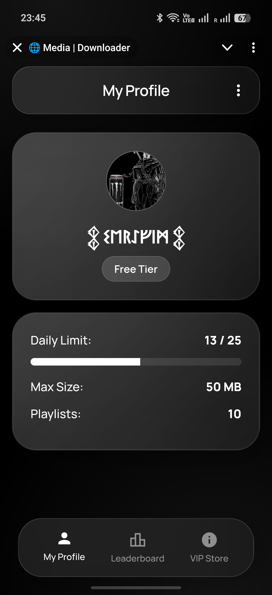
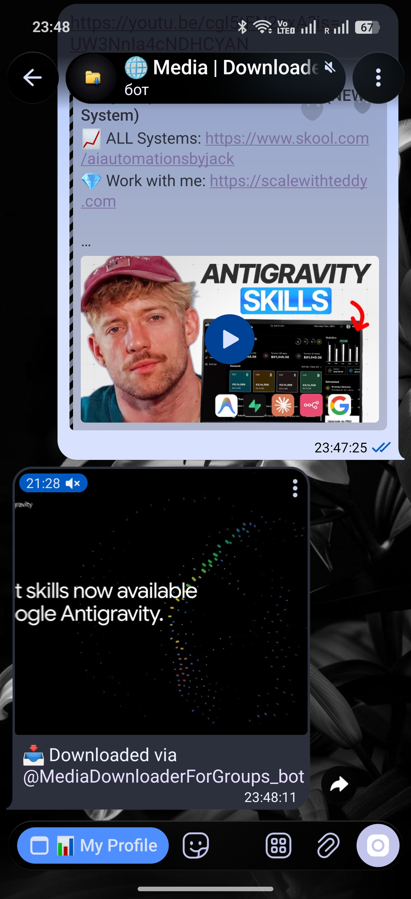
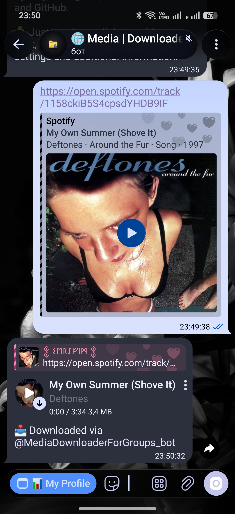

><div align="center">
  <h1>🚀 Media Downloader Bot</h1>
  <p>Функціональний Telegram-бот для завантаження мультимедійного контенту з популярних платформ та соціальних мереж.</p>
</div>

## 📖 Про проєкт

**Media Downloader Bot** — це сучасний Telegram-бот, розроблений на базі Python (Aiogram 3), який надає користувачам можливість зручно завантажувати відео, аудіо та зображення з таких платформ, як YouTube, YouTube Music, SoundCloud, Spotify, Instagram, Threads, Facebook та GitHub.

Проєкт включає інтегрований **Telegram Mini App** (Web App) із сучасним інтерфейсом, де користувачі можуть переглядати власну статистику, ліміти, рейтинги та оформлювати VIP-доступ за допомогою внутрішньої валюти **Telegram Stars**. Для забезпечення стабільної роботи з великими файлами (до 2 ГБ) використовується локальний сервер Telegram Bot API.

---

## ✨ Основні можливості

- 🎬 **YouTube та YouTube Music**: Завантаження відео та аудіофайлів у найвищій доступній якості (з використанням `yt-dlp`).
- 📸 **Instagram та Facebook**: Збереження відео (Reels), дописів та каруселей (з використанням `gallery-dl`).
- 🧵 **Threads**: Нативна підтримка завантаження мультимедійного контенту.
- 🎵 **Spotify**: Завантаження окремих треків та плейлистів зі збереженням метаданих та обкладинок (з використанням `spotdl`).
- 🎧 **SoundCloud**: Швидке завантаження аудіотреків та музичних сетів у високій якості.
- 💻 **GitHub**: Швидке завантаження вихідного коду репозиторіїв у форматі `.zip`.
- 📱 **Сучасний Web App**: Інтегрований міні-додаток, який містить профіль користувача, таблицю лідерів та розділ підписок.
- 💎 **Монетизація**: Вбудована система рівнів доступу (Free, Pro, Max, VIP) та підтримка платежів через Telegram Stars.
- 🚀 **Обробка великих файлів**: Можливість завантаження та надсилання файлів розміром до 2 ГБ завдяки використанню локального сервера Telegram Bot API.

---

## 🖼️ Демонстрація роботи

### 1. Головне меню та Mini App


### 2. Завантаження відео з YouTube


### 3. Завантаження музики зі Spotify


### 4. Завантаження медіа в Guest Mode


---

## 🛠 Технологічний стек

- **Backend**: Python 3.10+, [Aiogram 3](https://docs.aiogram.dev/en/latest/)
- **База даних**: SQLite (з використанням `aiosqlite`)
- **Компоненти завантаження**: `yt-dlp`, `gallery-dl`, `spotdl`
- **Обробка медіа**: `FFmpeg`, `mutagen`, `Pillow`
- **Frontend (Web App)**: HTML5, CSS3, Vanilla JS
- **Інфраструктура**: Локальний [Telegram Bot API Server](https://github.com/tdlib/telegram-bot-api)

---

## ⚙️ Локальне розгортання

### 1. Клонування репозиторію
```bash
git clone https://github.com/your-username/Media-Downloader-Bot.git
cd Media-Downloader-Bot
```

### 2. Налаштування середовища
Створіть файл `.env` у кореневій директорії проєкту та заповніть його наступними даними:
```env
BOT_TOKEN=ваш_токен_бота
LOCAL_API_SERVER_URL=http://127.0.0.1:8081
API_ID=ваш_api_id
API_HASH=ваш_api_hash
```

### 3. Встановлення залежностей
Переконайтеся, що у вашій системі встановлено `ffmpeg`.
```bash
python -m venv venv
source venv/bin/activate  # Для Windows: venv\Scripts\activate
pip install -r requirements.txt
```

### 4. Запуск бота
```bash
python main.py
```

---

## 🚀 Розгортання на сервері (Ubuntu/Debian)

У репозиторії передбачено скрипт для автоматичного розгортання бота разом із локальним сервером Telegram API. Скрипт самостійно встановить необхідні залежності, скомпілює сервер, створить віртуальне середовище Python та налаштує відповідні сервіси `systemd`.

```bash
git clone https://github.com/your-username/Media-Downloader-Bot.git
cd Media-Downloader-Bot
chmod +x auto_deploy.sh
./auto_deploy.sh
```

Після успішного виконання скрипта бот працюватиме у фоновому режимі безперервно.
Для перевірки журналів (логів) системи скористайтеся командою:
```bash
sudo journalctl -u tg-media-bot -f
```

---

## 🤝 Внесок у проєкт
Ми вітаємо будь-який внесок у розвиток проєкту. Для впровадження значних змін, будь ласка, спершу створіть issue для обговорення запропонованих нововведень.