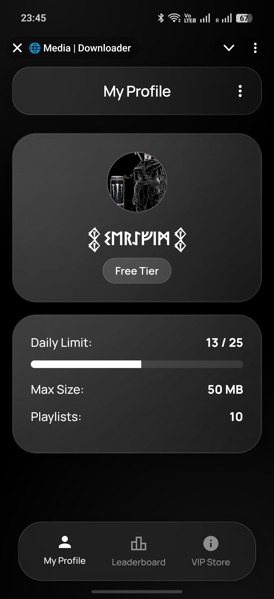
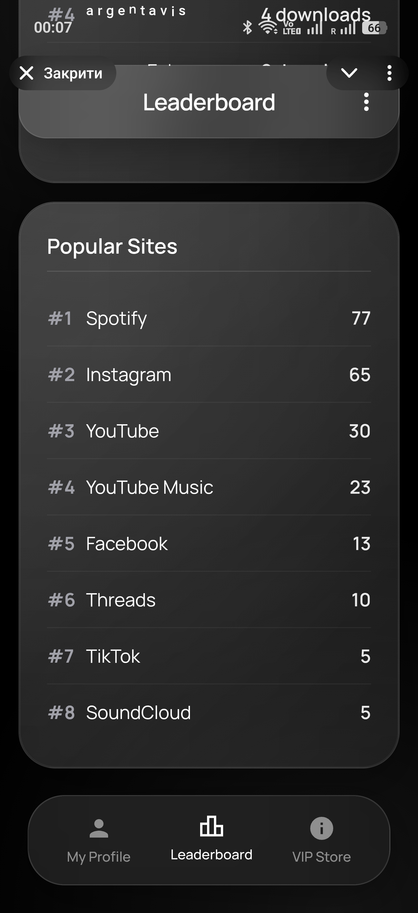
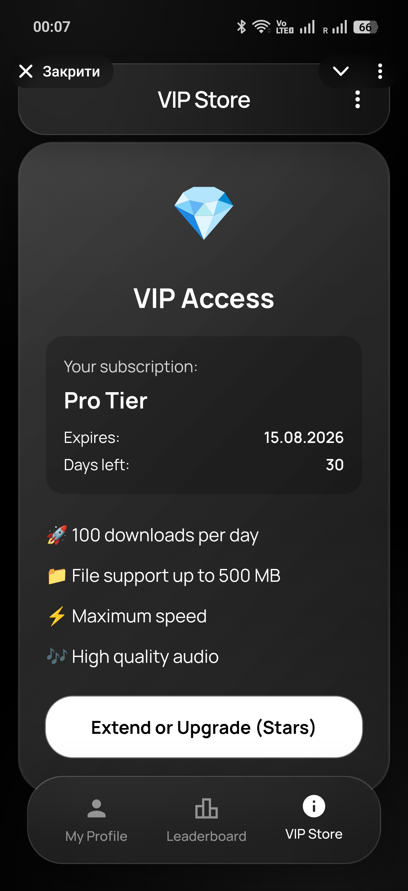
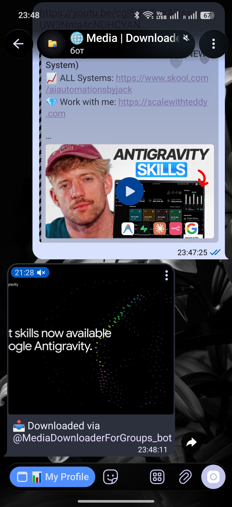
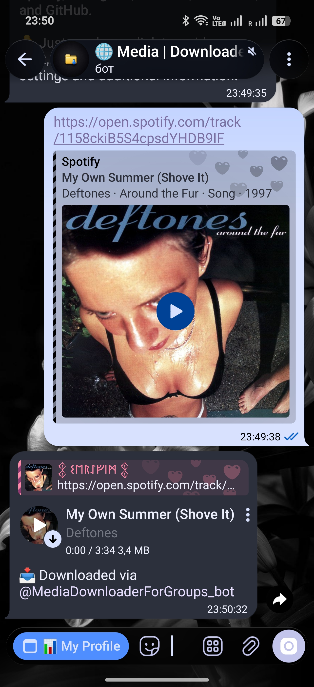
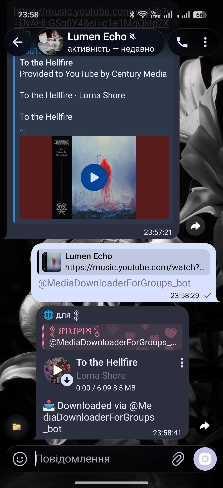

<div align="center">
  <h1>🚀 Media Downloader Bot</h1>
  <p>A feature-rich Telegram bot for downloading media content from popular social networks and video platforms.</p>

  <p>
    <b>Language / Мова / Język:</b><br/>
    <a href="README.md">🇬🇧 English</a> •
    <a href="docs/README_UA.md">🇺🇦 Українська</a> •
    <a href="docs/README_PL.md">🇵🇱 Polski</a>
  </p>
</div>

<p align="center">
  <a href="https://t.me/SaveMDLBot">
    
  </a>
</p>

## 📖 About The Project

**Media Downloader Bot** is a modern Telegram bot powered by Python (Aiogram 3) that allows users to easily download videos, audio, and images from platforms like YouTube, YouTube Music, SoundCloud, Spotify, TikTok, Instagram, Threads, Facebook, and GitHub.

The project features an integrated **Telegram Mini App** (Web App) with a sleek UI where users can view their personal statistics, limits, leaderboards, and subscribe to VIP access using **Telegram Stars**. To ensure seamless handling of large files (up to 2 GB), it uses a self-hosted local Telegram Bot API server.

---

## ✨ Key Features

- 🎬 **YouTube & YouTube Music**: Video and audio downloads in highest available quality (via `yt-dlp`).
- 📸 **Instagram, Facebook & TikTok**: Download Reels, TikToks, posts, and carousel albums (via `gallery-dl` & `yt-dlp`).
- 🧵 **Threads**: Native media post extraction and downloading.
- 🎵 **Spotify**: Track and playlist downloading with full metadata and cover art preservation (via `spotdl`).
- 🎧 **SoundCloud**: High-quality audio track and set downloads.
- 💻 **GitHub**: Download repository source code directly as `.zip` archives.
- 📱 **Modern Web App**: Integrated Mini App containing user profiles, leaderboards, and VIP shop.
- 💎 **Monetization**: Tiered access system (Free, Pro, Max, VIP) with integrated Telegram Stars payments.
- 🚀 **Large File Support**: Download and send media files up to 2 GB using a local Telegram Bot API server.

---

## 🖼️ Demo & Screenshots

| Main Menu & Mini App | Leaderboard | VIP Store |
| :---: | :---: | :---: |
|  |  |  |
| **YouTube Downloads** | **Spotify Music** | **Guest Mode** |
|  |  |  |

---

## 📋 System Requirements

| Requirement | Minimum | Recommended |
| :--- | :--- | :--- |
| **OS** | Ubuntu 20.04 / Debian 11 | Ubuntu 22.04+ / Debian 12 |
| **RAM** | 1 GB | 2 GB+ |
| **Disk Space** | 5 GB free | 20 GB+ free |
| **Python** | 3.10+ | 3.10+ |
| **Dependencies** | Git, FFmpeg, C++ Build Tools | Git, FFmpeg, C++ Build Tools |

---

## 🛠 Tech Stack

- **Backend**: Python 3.10+, [Aiogram 3](https://docs.aiogram.dev/en/latest/)
- **Database**: SQLite (via `aiosqlite`)
- **Downloader Engines**: `yt-dlp`, `gallery-dl`, `spotdl`
- **Media Processing**: `FFmpeg`, `mutagen`, `Pillow`
- **Frontend (Web App)**: HTML5, CSS3, Vanilla JS
- **Infrastructure**: Local [Telegram Bot API Server](https://github.com/tdlib/telegram-bot-api)

---

## ⚙️ Local Development Setup

### 1. Clone the Repository
```bash
git clone https://github.com/your-username/Media-Downloader-Bot.git
cd Media-Downloader-Bot
```

### 2. Environment Configuration
Create a `.env` file in the project root directory:
```env
BOT_TOKEN=your_bot_token
LOCAL_API_SERVER_URL=http://127.0.0.1:8081
API_ID=your_api_id
API_HASH=your_api_hash
ADMIN_IDS=your_telegram_id
```

### 3. Install Dependencies
Ensure `ffmpeg` is installed on your system.
```bash
python -m venv venv
source venv/bin/activate  # On Windows: venv\Scripts\activate
pip install -r requirements.txt
```

### 4. Run the Bot
```bash
python main.py
```

---

## 🚀 Server Deployment (Ubuntu/Debian)

1. Get your bot token from [@BotFather](https://t.me/BotFather) and user ID from [@userinfobot](https://t.me/userinfobot) (for `ADMIN_IDS`).
2. Obtain `API_ID` and `API_HASH` from [my.telegram.org](https://my.telegram.org).
3. Clone the repo and run the automated setup script:
   ```bash
   git clone https://github.com/your-username/Media-Downloader-Bot.git
   cd Media-Downloader-Bot
   chmod +x auto_deploy.sh
   ./auto_deploy.sh
   ```
4. Upload `cookies.txt` to the project root for YouTube 18+, Instagram, and Facebook downloads.

📖 **Detailed Installation Guide:** For step-by-step instructions, credentials acquisition, systemd configuration, and troubleshooting, see the [English Server Installation Guide (install_guide.md)](docs/install_guide.md).

---

## 🐳 Docker Deployment

```bash
touch cookies.txt   # or copy in a real one for Instagram/Facebook/YouTube 18+
docker compose up -d
```

Builds the bot and pulls a prebuilt `telegram-bot-api` image ([`aiogram/telegram-bot-api`](https://hub.docker.com/r/aiogram/telegram-bot-api)), rebuilt daily from upstream `tdlib/telegram-bot-api`. `.env` and `cookies.txt` are read at runtime, never baked into the image.

Prefer to compile `telegram-bot-api` from source instead (takes ~25 minutes)?
```bash
docker compose -f docker-compose.yml -f docker-compose.build.yml up -d --build
```

---

## ⚠️ Disclaimer

This project is created **for educational and research purposes only** as a demonstration of bot development, API integrations, and media handling.  
The authors and contributors bear no responsibility for how end-users utilize this software or for any potential violations of copyright, local laws, or third-party Terms of Service. Always comply with applicable laws and respect creators' rights.

---

## 🤝 Contributing

Contributions, issues, and feature requests are welcome! Feel free to check the issues page or open a discussion for significant changes.