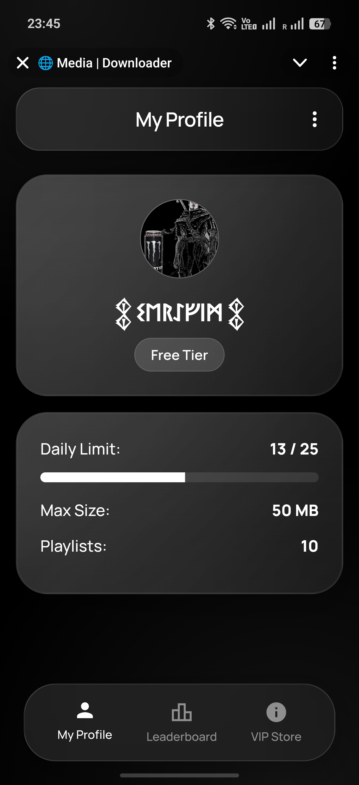
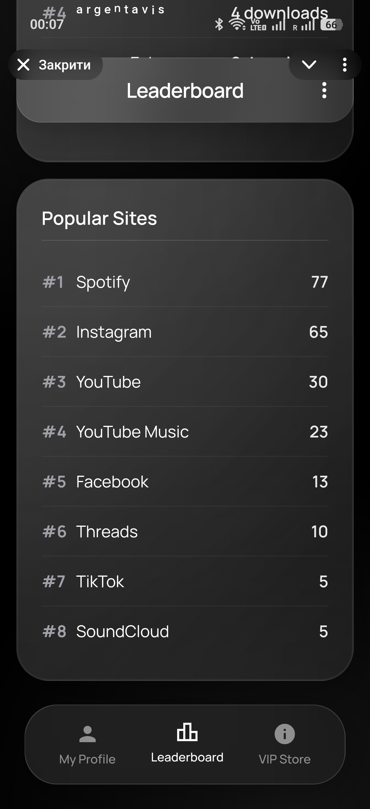
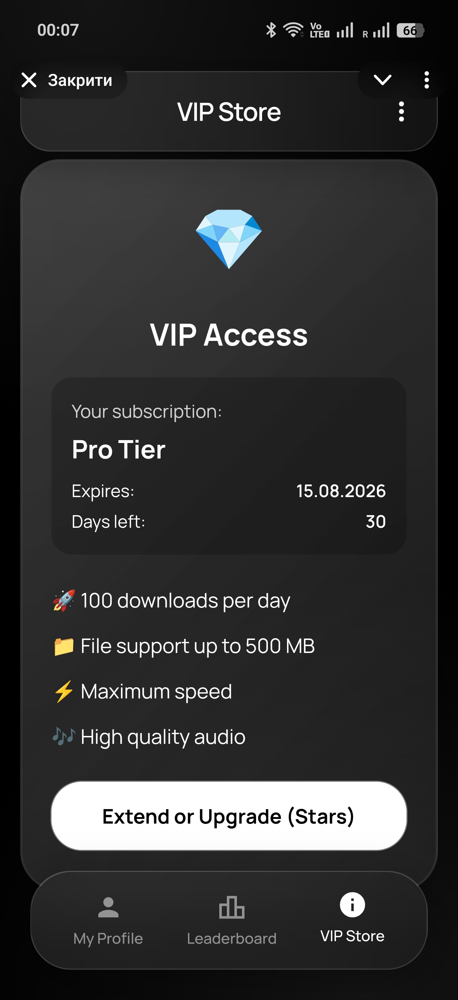
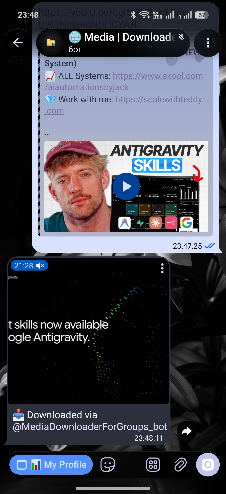
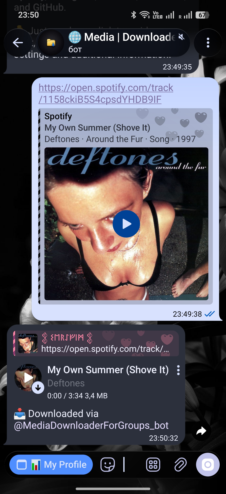
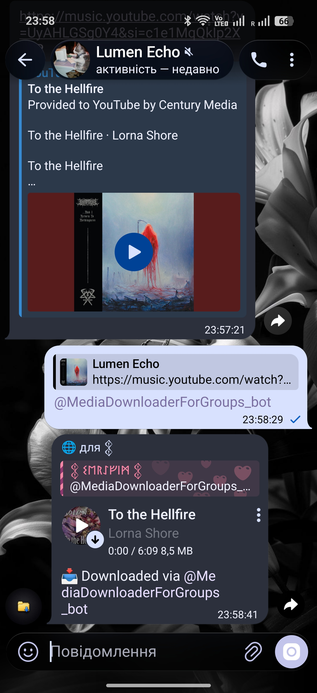

<p align="center">
  <a href="README.md">🇬🇧 English</a> | <a href="README.uk.md">🇺🇦 Українська</a> | <b>🇵🇱 Polski</b>
</p>

<div align="center">
  <h1>🚀 Media Downloader Bot</h1>
  <p>Funkcjonalny bot Telegram do pobierania treści multimedialnych z popularnych platform i serwisów społecznościowych.</p>
</div>

<p align="center">
  <a href="https://github.com/dmytrokurochkin/Media-Downloader-Bot/actions/workflows/tests.yml">
    
  </a>
</p>

<p align="center">
  <a href="https://t.me/SaveMDLBot">
    
  </a>
</p>

## 📖 O projekcie

**Media Downloader Bot** to nowoczesny bot Telegram zbudowany w oparciu o Python (Aiogram 3), który umożliwia użytkownikom wygodne pobieranie wideo, audio i zdjęć z platform takich jak YouTube, YouTube Music, SoundCloud, Spotify, TikTok, Instagram, Threads, Facebook oraz GitHub.

Projekt zawiera zintegrowaną **Telegram Mini App** (Web App) z nowoczesnym interfejsem, w której użytkownicy mogą przeglądać własne statystyki, limity, rankingi oraz wykupić dostęp VIP za pomocą wewnętrznej waluty **Telegram Stars**. Do niezawodnej obsługi dużych plików (do 2 GB) wykorzystywany jest lokalny serwer Telegram Bot API.

---

## ✨ Główne funkcje

- 🎬 **YouTube i YouTube Music**: Pobieranie filmów i plików audio w najwyższej dostępnej jakości (przy użyciu `yt-dlp`).
- 📸 **Instagram, Facebook i TikTok**: Zapisywanie filmów (Reels, TikTok), postów i karuzeli (przy użyciu `gallery-dl` oraz `yt-dlp`).
- 🧵 **Threads**: Natywne wsparcie pobierania treści multimedialnych.
- 🎵 **Spotify**: Pobieranie pojedynczych utworów i playlist z zachowaniem metadanych i okładek (przy użyciu `spotdl`).
- 🎧 **SoundCloud**: Szybkie pobieranie utworów audio i setów muzycznych w wysokiej jakości.
- 💻 **GitHub**: Szybkie pobieranie kodu źródłowego repozytorium w formacie `.zip`.
- 📱 **Nowoczesna Web App**: Zintegrowana mini-aplikacja z profilem użytkownika, rankingiem oraz sekcją subskrypcji.
- 💎 **Monetyzacja**: Wbudowany system poziomów dostępu (Free, Pro, Max, VIP) z obsługą płatności przez Telegram Stars.
- 🚀 **Obsługa dużych plików**: Pobieranie i wysyłanie plików o rozmiarze do 2 GB dzięki lokalnemu serwerowi Telegram Bot API.

---

## 🖼️ Demonstracja

| Menu główne i Mini App | Ranking (Leaderboard) | Sklep VIP (Store) |
| :---: | :---: | :---: |
|  |  |  |
| **Pobieranie z YouTube** | **Muzyka ze Spotify** | **Tryb gościa** |
|  |  |  |

---

## 🛠 Stos technologiczny

- **Backend**: Python 3.10+, [Aiogram 3](https://docs.aiogram.dev/en/latest/)
- **Baza danych**: SQLite (przy użyciu `aiosqlite`)
- **Komponenty pobierania**: `yt-dlp`, `gallery-dl`, `spotdl`
- **Przetwarzanie mediów**: `FFmpeg`, `mutagen`, `Pillow`
- **Frontend (Web App)**: HTML5, CSS3, Vanilla JS
- **Infrastruktura**: Lokalny [Telegram Bot API Server](https://github.com/tdlib/telegram-bot-api)

---

## ⚙️ Wdrożenie lokalne

### 1. Klonowanie repozytorium
```bash
git clone https://github.com/dmytrokurochkin/Media-Downloader-Bot.git
cd Media-Downloader-Bot
```

### 2. Konfiguracja środowiska
Utwórz plik `.env` w katalogu głównym projektu i uzupełnij go następującymi danymi:
```env
BOT_TOKEN=twój_token_bota
LOCAL_API_SERVER_URL=http://127.0.0.1:8081
API_ID=twój_api_id
API_HASH=twój_api_hash
```

### 3. Instalacja zależności
Upewnij się, że w systemie zainstalowany jest `ffmpeg`.
```bash
python -m venv venv
source venv/bin/activate  # Dla Windows: venv\Scripts\activate
pip install -r requirements.txt
```

### 4. Uruchomienie bota
```bash
python main.py
```

---

## 🚀 Wdrożenie na serwerze (Ubuntu/Debian)

Repozytorium zawiera skrypt do automatycznego wdrożenia bota razem z lokalnym serwerem Telegram API. Skrypt samodzielnie zainstaluje wymagane zależności, skompiluje serwer, utworzy wirtualne środowisko Python i skonfiguruje odpowiednie usługi `systemd`.

```bash
git clone https://github.com/dmytrokurochkin/Media-Downloader-Bot.git
cd Media-Downloader-Bot
chmod +x auto_deploy.sh
./auto_deploy.sh
```

Po pomyślnym wykonaniu skryptu bot będzie działał nieprzerwanie w tle.
Aby sprawdzić logi systemowe, użyj polecenia:
```bash
sudo journalctl -u tg-media-bot -f
```

## ⚠️ Informacje prawne (Disclaimer)

Ten projekt został stworzony **wyłącznie w celach edukacyjnych i badawczych**, jako demonstracja możliwości tworzenia botów, integracji z API oraz przetwarzania plików multimedialnych.
Autorzy i współtwórcy nie ponoszą żadnej odpowiedzialności za wykorzystanie tego oprogramowania przez użytkowników końcowych w sposób, który może naruszać prawa autorskie, przepisy jakiegokolwiek kraju lub Regulamin (Terms of Service) platform zewnętrznych. Pobierając treści, użytkownik jest zobowiązany przestrzegać obowiązującego prawa i szanować prawa twórców.

---

## 🤝 Współtworzenie
Zapraszamy do wszelkiego wkładu w rozwój projektu. W przypadku istotnych zmian prosimy najpierw utworzyć issue, aby omówić proponowane zmiany. Zobacz [CONTRIBUTING.md](CONTRIBUTING.md) (po angielsku), aby dowiedzieć się, jak skonfigurować środowisko deweloperskie, uruchomić testy i zgłosić pull request. Prosimy również przestrzegać naszego [Kodeksu postępowania](CODE_OF_CONDUCT.md). Znalazłeś lukę bezpieczeństwa? Zobacz [SECURITY.md](SECURITY.md).
