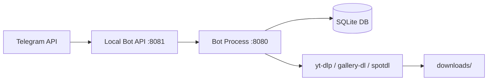

🌐 **Language / Мова:** [English](install_guide.md) | [Українська](install_guide_ua.md) | [Polski](install_guide_pl.md)

---

# Media Downloader Bot — Server Installation Guide (Ubuntu/Debian)

Comprehensive step-by-step guide to deploying and configuring the Telegram Media Downloader Bot on a Linux server.

---

## 📋 System Requirements

| Requirement | Minimum Value |
| :--- | :--- |
| **OS** | Ubuntu 20.04 / Debian 11 |
| **RAM** | 1 GB |
| **Disk Space** | 5 GB free |
| **Python** | 3.10+ |

---

## Step 1 — Obtain Your Credentials

### 1. Bot Token (`BOT_TOKEN`)
1. Open Telegram and search for [@BotFather](https://t.me/BotFather).
2. Send the `/newbot` command.
3. Choose a name for your bot (e.g., `My Media Downloader`).
4. Choose a username ending in `bot` (e.g., `MyMediaBot`).
5. Copy the generated token (looks like `123456:ABC-DEF1234ghIkl-zyx57W2v1u123ew11`) — this is your `BOT_TOKEN`.

### 2. `API_ID` and `API_HASH`
1. Go to [my.telegram.org](https://my.telegram.org).
2. Log in using your phone number.
3. Click on **API development tools**.
4. Fill in the form:
   - **App title**: any name (e.g., `MediaBot`)
   - **Short name**: any short name (e.g., `mediabot`)
   - **URL**: leave blank or enter your website
   - **Platform**: select `Other`
   - **Description**: leave blank
5. Click **Create application**.
6. Save both the **App api_id** (a number) and **App api_hash** (32-character hex string).

### 3. Telegram User ID (`ADMIN_IDS`)
1. Open Telegram and search for [@userinfobot](https://t.me/userinfobot).
2. Send any message to the bot.
3. Copy your numeric ID (e.g., `123456789`) — this is your `ADMIN_IDS`.

### 4. Error Log Channel ID (`ERROR_LOG_CHANNEL_ID`) *(Optional)*
1. Create a Telegram channel (private or public).
2. Add your bot as an administrator to the channel.
3. Forward a message from the channel to [@userinfobot](https://t.me/userinfobot) or [@getidsbot](https://t.me/getidsbot).
4. Alternatively, use the Telegram API: `https://api.telegram.org/bot<TOKEN>/getUpdates` — look for `chat.id` (usually starts with a minus sign, e.g., `-1001234567890`).

---

## Step 2 — SSH Into Your Server

```bash
ssh root@your-server-ip
```

---

## Step 3 — Clone Repository and Auto-Deploy

```bash
# Update system packages and install dependencies
sudo apt-get update
sudo apt-get install -y git ffmpeg

# Clone the repository
git clone https://github.com/your-username/Media-Downloader-Bot.git
cd Media-Downloader-Bot

# Make script executable and run auto-deploy
chmod +x auto_deploy.sh
./auto_deploy.sh
```

During execution, the script will prompt you for the following inputs:
- `BOT_TOKEN` — Bot token from @BotFather
- `BOT_USERNAME` — Bot username without `@` (e.g., `SaveMDLBot`)
- `API_ID` — Numeric API ID from my.telegram.org
- `API_HASH` — Hex API hash from my.telegram.org
- `ADMIN_IDS` — Your numeric Telegram user ID from @userinfobot
- `Mini App URL` — URL of your Mini App (e.g., GitHub Pages) or leave blank if not used

---

## Step 4 — Export Browser Cookies (`cookies.txt` - Required for YouTube 18+, Instagram, Facebook)

The bot supports downloading age-restricted YouTube videos (18+), private Instagram posts, and Facebook media. To download these successfully, it requires session cookies from a logged-in browser.

### Why `cookies.txt` is Required
It is a Netscape-formatted text file containing session cookies. The bot passes this file to `yt-dlp` and `gallery-dl` so requests appear as coming from an authenticated user.

### How to Get `cookies.txt`

#### Option A: Chrome / Brave / Edge (Recommended)
1. Install the extension [Get cookies.txt LOCALLY](https://chrome.google.com/webstore/detail/get-cookiestxt-locally/cclelndahbckbenkjhflpdbgdldlbecc).
2. Log into YouTube (and Instagram/Facebook if needed).
3. Click the extension icon while on each site.
4. Click **Export** — it downloads a `cookies.txt` file.

#### Option B: Firefox
1. Install the **cookies.txt** addon from Firefox Add-ons.
2. Log into your accounts.
3. Right-click on the page → **Export Cookies**.

#### Option C: Manual (Any Browser)
1. Open DevTools (`F12`) → **Application** tab → **Cookies**.
2. Format entries into Netscape format:
```text
.domain.com	TRUE	/	FALSE	0	cookie_name	cookie_value
```

### Uploading to Server

From your local machine, use SCP:
```bash
scp cookies.txt root@your-server-ip:/root/Media-Downloader-Bot/cookies.txt
```

Or create the file directly on the server:
```bash
nano cookies.txt
# paste cookie contents, save with Ctrl+O, Enter, Ctrl+X
```

Verify placement:
```bash
ls -la /root/Media-Downloader-Bot/cookies.txt
```

> [!IMPORTANT]
> On headless servers (without a GUI browser), `cookies.txt` is the only way to enable age-restricted YouTube content and private social media downloads.

---

## Step 5 — Verify Running Services

```bash
# Check bot status
sudo systemctl status tg-media-bot

# Check local Telegram API server status
sudo systemctl status telegram-bot-api

# View live bot logs
sudo journalctl -u tg-media-bot -f
```

---

## 🛠 Useful Management Commands

```bash
# Restart bot after configuration changes
sudo systemctl restart tg-media-bot

# Edit environment variables
nano .env
sudo systemctl restart tg-media-bot

# Update bot from git
git pull
sudo systemctl restart tg-media-bot

# Stop all services
sudo systemctl stop tg-media-bot telegram-bot-api

# Start all services
sudo systemctl start telegram-bot-api tg-media-bot
```

---

## ⚙️ Environment Variables Reference (`.env`)

| Variable | Required | Description / Source |
| :--- | :---: | :--- |
| `BOT_TOKEN` | Yes | Token from @BotFather |
| `BOT_USERNAME` | Yes | Bot username (without `@`) |
| `API_ID` | Yes | Numeric API ID from my.telegram.org |
| `API_HASH` | Yes | Hex API hash from my.telegram.org |
| `ADMIN_IDS` | Yes | Numeric ID from @userinfobot |
| `LOCAL_API_SERVER_URL` | No | Local Telegram API URL (default `http://127.0.0.1:8081`) |
| `PUBLIC_API_URL` | No | Optional public API URL |
| `ERROR_LOG_CHANNEL_ID` | No | Channel ID for error logs |
| `ALLOWED_CORS_ORIGINS` | No | Domain URL of your Mini App |

---

## ❓ Troubleshooting

| Issue | Cause / Fix |
| :--- | :--- |
| **Bot fails to start** | Check `.env` for trailing whitespace. Run `sudo journalctl -u tg-media-bot -n 50`. |
| **"Local API server not ready"** | Run `sudo systemctl restart telegram-bot-api`, wait 10 seconds, then restart bot with `sudo systemctl restart tg-media-bot`. |
| **YouTube downloads fail** | Place `cookies.txt` in the project root directory (see Step 4). |
| **Instagram downloads fail** | Ensure `cookies.txt` includes a valid Instagram session cookie. |
| **Large files (>50MB) fail** | Verify `LOCAL_API_SERVER_URL` is configured and `telegram-bot-api` is running on port 8081. |
| **Permission denied** | Run service commands using `sudo` or as `root`. |
| **Mini App broken** | Ensure `ALLOWED_CORS_ORIGINS` matches your Mini App URL exactly. |

---

## 🏗 System Architecture


