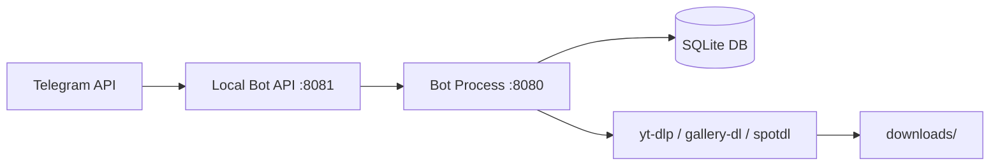

🌐 **Język / Language:** [English](install_guide.md) | [Українська](install_guide_ua.md) | [Polski](install_guide_pl.md)

---

# Instrukcja instalacji Media Downloader Bot na serwerze (Ubuntu/Debian)

Szczegółowy przewodnik krok po kroku dotyczący wdrażania i konfiguracji bota Telegram Media Downloader na serwerze z systemem Linux.

---

## 📋 Wymagania systemowe

| Wymaganie | Wartość minimalna |
| :--- | :--- |
| **System operacyjny** | Ubuntu 20.04 / Debian 11 |
| **Pamięć RAM** | 1 GB |
| **Miejsce na dysku** | 5 GB wolnej przestrzeni |
| **Python** | 3.10+ |

---

## Krok 1 — Pozyskanie danych uwierzytelniających

### 1. Token bota (`BOT_TOKEN`)
1. Otwórz Telegram i wyszukaj bot [@BotFather](https://t.me/BotFather).
2. Wyślij polecenie `/newbot`.
3. Podaj nazwę dla swojego bota (np. `My Media Downloader`).
4. Podaj nazwę użytkownika (username) kończącą się słowem `bot` (np. `MyMediaBot`).
5. Skopiuj wygenerowany token (w postaci `123456:ABC-DEF1234ghIkl-zyx57W2v1u123ew11`) — jest to Twój `BOT_TOKEN`.

### 2. `API_ID` oraz `API_HASH`
1. Przejdź do strony [my.telegram.org](https://my.telegram.org).
2. Zaloguj się przy użyciu swojego numeru telefonu.
3. Kliknij **API development tools**.
4. Wypełnij formularz:
   - **App title**: dowolna nazwa (np. `MediaBot`)
   - **Short name**: dowolna krótka nazwa (np. `mediabot`)
   - **URL**: możesz zostawić puste lub podać adres strony
   - **Platform**: wybierz `Other`
   - **Description**: możesz zostawić puste
5. Kliknij **Create application**.
6. Zapisz zarówno **App api_id** (liczba), jak i **App api_hash** (32-znakowy ciąg heksadecymalny).

### 3. Telegram User ID (`ADMIN_IDS`)
1. Otwórz Telegram i wyszukaj bot [@userinfobot](https://t.me/userinfobot).
2. Wyślij dowolną wiadomość do bota.
3. Skopiuj swój numeryczny identyfikator ID (np. `123456789`) — jest to Twój `ADMIN_IDS`.

### 4. ID kanału dla logów błędów (`ERROR_LOG_CHANNEL_ID`) *(opcjonalnie)*
1. Utwórz kanał w Telegramie (prywatny lub publiczny).
2. Dodaj swojego bota jako administratora kanału.
3. Przekaż wiadomość z kanału do [@userinfobot](https://t.me/userinfobot) lub [@getidsbot](https://t.me/getidsbot).
4. Alternatywnie użyj Telegram API: `https://api.telegram.org/bot<TOKEN>/getUpdates` — poszukaj `chat.id` (zazwyczaj rozpoczynającego się od minusa, np. `-1001234567890`).

---

## Krok 2 — Połączenie z serwerem przez SSH

```bash
ssh root@your-server-ip
```

---

## Krok 3 — Klonowanie repozytorium i automatyczna instalacja

```bash
# Aktualizacja pakietów systemowych i instalacja zależności
sudo apt-get update
sudo apt-get install -y git ffmpeg

# Klonowanie repozytorium
git clone https://github.com/your-username/Media-Downloader-Bot.git
cd Media-Downloader-Bot

# Nadanie praw wykonywania i uruchomienie skryptu auto-deploy
chmod +x auto_deploy.sh
./auto_deploy.sh
```

Podczas wykonywania skrypt poprosi o wprowadzenie następujących danych:
- `BOT_TOKEN` — token bota z @BotFather
- `BOT_USERNAME` — nazwa użytkownika bota bez `@` (np. `SaveMDLBot`)
- `API_ID` — numeryczny API ID z my.telegram.org
- `API_HASH` — heksadecymalny API hash z my.telegram.org
- `ADMIN_IDS` — Twój numeryczny ID z @userinfobot
- `Mini App URL` — adres URL Twojej aplikacji Mini App (np. GitHub Pages) lub pozostaw puste

---

## Krok 4 — Eksport plików ciasteczek (`cookies.txt` - Wymagane dla YouTube 18+, Instagram, Facebook)

Bot wspiera pobieranie materiałów z ograniczeniem wiekowym z YouTube (18+), prywatnych postów z Instagrama oraz mediów z Facebooka. Do poprawnego pobierania tych treści wymagane są pliki cookies zalogowanego użytkownika.

### Dlaczego plik `cookies.txt` jest wymagany
Jest to plik tekstowy w formacie Netscape zawierający ciasteczka sesji. Bot przekazuje ten plik narzędziom `yt-dlp` oraz `gallery-dl`, dzięki czemu żądania wyglądają tak, jakby pochodziły od uwierzytelnionego użytkownika.

### Jak uzyskać plik `cookies.txt`

#### Opcja A: Chrome / Brave / Edge (Zalecane)
1. Zainstaluj rozszerzenie [Get cookies.txt LOCALLY](https://chrome.google.com/webstore/detail/get-cookiestxt-locally/cclelndahbckbenkjhflpdbgdldlbecc).
2. Zaloguj się na YouTube (oraz na Instagram/Facebook, jeśli potrzebujesz).
3. Kliknij ikonę rozszerzenia na danej stronie.
4. Kliknij **Export** — pobrany zostanie plik `cookies.txt`.

#### Opcja B: Firefox
1. Zainstaluj dodatek **cookies.txt** z portalu Firefox Add-ons.
2. Zaloguj się na swoje konta.
3. Kliknij prawym przyciskiem myszy na stronie → **Export Cookies**.

#### Opcja C: Ręcznie (dowolna przeglądarka)
1. Otwórz Narzędzia deweloperskie (`F12`) → zakładka **Application** / **Aplikacja** → **Cookies**.
2. Skopiuj wpisy i sformatuj je do formatu Netscape:
```text
.domain.com	TRUE	/	FALSE	0	cookie_name	cookie_value
```

### Przesyłanie na serwer

Z lokalnego komputera użyj polecenia SCP:
```bash
scp cookies.txt root@your-server-ip:/root/Media-Downloader-Bot/cookies.txt
```

Lub utwórz plik bezpośrednio na serwerze:
```bash
nano cookies.txt
# wklej zawartość, zapisz za pomocą Ctrl+O, Enter, Ctrl+X
```

Weryfikacja lokalizacji pliku:
```bash
ls -la /root/Media-Downloader-Bot/cookies.txt
```

> [!IMPORTANT]
> Na serwerach bez interfejsu graficznego (headless) brak jest przeglądarek, dlatego plik `cookies.txt` jest jedynym sposobem na pobieranie treści z ograniczeniami wiekowymi oraz prywatnych postów.

---

## Krok 5 — Weryfikacja działających usług

```bash
# Sprawdzenie statusu bota
sudo systemctl status tg-media-bot

# Sprawdzenie statusu lokalnego serwera Telegram Bot API
sudo systemctl status telegram-bot-api

# Podgląd logów bota na żywo
sudo journalctl -u tg-media-bot -f
```

---

## 🛠 Przydatne polecenia zarządzające

```bash
# Restart bota po zmianie konfiguracji
sudo systemctl restart tg-media-bot

# Edycja zmiennych środowiskowych
nano .env
sudo systemctl restart tg-media-bot

# Aktualizacja bota z repozytorium Git
git pull
sudo systemctl restart tg-media-bot

# Zatrzymaj wszystkie usługi
sudo systemctl stop tg-media-bot telegram-bot-api

# Uruchom wszystkie usługi
sudo systemctl start telegram-bot-api tg-media-bot
```

---

## ⚙️ Opis zmiennych środowiskowych (`.env`)

| Zmienna | Wymagana | Opis / Źródło |
| :--- | :---: | :--- |
| `BOT_TOKEN` | Tak | Token wygenerowany w @BotFather |
| `BOT_USERNAME` | Tak | Nazwa użytkownika bota (bez `@`) |
| `API_ID` | Tak | Numeryczny API ID z my.telegram.org |
| `API_HASH` | Tak | Heksadecymalny API hash z my.telegram.org |
| `ADMIN_IDS` | Tak | Numeryczny ID użytkownika z @userinfobot |
| `LOCAL_API_SERVER_URL` | Nie | Adres lokalnego Telegram API (domyślnie `http://127.0.0.1:8081`) |
| `PUBLIC_API_URL` | Nie | Opcjonalny publiczny adres URL API |
| `ERROR_LOG_CHANNEL_ID` | Nie | ID kanału przeznaczonego na logi błędów |
| `ALLOWED_CORS_ORIGINS` | Nie | Adres domeny Twojej aplikacji Telegram Mini App |

---

## ❓ Rozwiązywanie problemów (Troubleshooting)

| Problem | Przyczyna / Rozwiązanie |
| :--- | :--- |
| **Bot nie uruchamia się** | Sprawdź plik `.env` pod kątem zbędnych spacji na końcach linii. Uruchom `sudo journalctl -u tg-media-bot -n 50`. |
| **"Local API server not ready"** | Wykonaj `sudo systemctl restart telegram-bot-api`, odczekaj 10 sekund, a następnie zrestartuj bota poleceniem `sudo systemctl restart tg-media-bot`. |
| **Błędy pobierania z YouTube** | Umieść plik `cookies.txt` w głównym katalogu projektu (patrz Krok 4). |
| **Błędy pobierania z Instagrama** | Upewnij się, że plik `cookies.txt` zawiera ciasteczka aktywnej sesji z Instagrama. |
| **Błędy przy plikach >50MB** | Upewnij się, że skonfigurowano `LOCAL_API_SERVER_URL` oraz że `telegram-bot-api` działa na porcie 8081. |
| **Permission denied** | Uruchamiaj komendy usług używając `sudo` lub z poziomu konta `root`. |
| **Mini App nie działa** | Upewnij się, że `ALLOWED_CORS_ORIGINS` w pliku `.env` dokładnie odpowiada adresowi URL Twojej aplikacji Mini App. |

---

## 🏗 Architektura systemu


