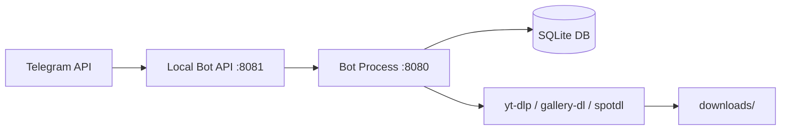

🌐 **Мова / Language:** [English](install_guide.md) | [Українська](install_guide_ua.md) | [Polski](install_guide_pl.md)

---

# Інструкція з інсталяції Media Downloader Bot (Ubuntu/Debian)

Детальне керівництво з розгортання та налаштування Telegram Media Downloader Bot на сервері Linux.

---

## 📋 Системні вимоги

| Параметр | Мінімальне значення |
| :--- | :--- |
| **ОС** | Ubuntu 20.04 / Debian 11 |
| **ОЗП (RAM)** | 1 ГБ |
| **Диск** | 5 ГБ вільного місця |
| **Python** | 3.10+ |

---

## Крок 1 — Отримання credentials (ключів та параметрів)

### 1. Токен бота (`BOT_TOKEN`)
1. Відкрийте Telegram і знайдіть [@BotFather](https://t.me/BotFather).
2. Надішліть команду `/newbot`.
3. Уведіть назву бота (наприклад, `My Media Downloader`).
4. Уведіть username бота, що закінчується на `bot` (наприклад, `MyMediaBot`).
5. Скопіюйте отриманий токен (вигляду `123456:ABC-DEF1234ghIkl-zyx57W2v1u123ew11`) — це ваш `BOT_TOKEN`.

### 2. `API_ID` та `API_HASH`
1. Перейдіть на [my.telegram.org](https://my.telegram.org).
2. Увійдіть за допомогою свого номера телефону.
3. Оберіть **API development tools**.
4. Заповніть форму:
   - **App title**: будь-яка назва (наприклад, `MediaBot`)
   - **Short name**: будь-яка коротка назва (наприклад, `mediabot`)
   - **URL**: можна залишити порожнім
   - **Platform**: оберіть `Other`
   - **Description**: можна залишити порожнім
5. Натисніть **Create application**.
6. Збережіть **App api_id** (число) та **App api_hash** (32-значний hex-рядок).

### 3. Ваш Telegram User ID (`ADMIN_IDS`)
1. Знайдіть у Telegram бота [@userinfobot](https://t.me/userinfobot).
2. Надішліть йому будь-яке повідомлення.
3. Скопіюйте числове значення вашого ID (наприклад, `123456789`) — це `ADMIN_IDS`.

### 4. ID каналу для логів помилок (`ERROR_LOG_CHANNEL_ID`) *(опціонально)*
1. Створіть канал у Telegram (приватний або публічний).
2. Додайте вашого бота як адміністратора каналу.
3. Перешліть будь-яке повідомлення з каналу в [@userinfobot](https://t.me/userinfobot) або [@getidsbot](https://t.me/getidsbot).
4. Або скористайтеся Telegram API: `https://api.telegram.org/bot<TOKEN>/getUpdates` — знайдіть `chat.id` (зазвичай починається з мінуса, наприклад `-1001234567890`).

---

## Крок 2 — Підключення до сервера через SSH

```bash
ssh root@your-server-ip
```

---

## Крок 3 — Клонування репозиторію та автоматичне встановлення

```bash
# Оновлення пакетів та встановлення системних залежностей
sudo apt-get update
sudo apt-get install -y git ffmpeg

# Клонування репозиторію
git clone https://github.com/your-username/Media-Downloader-Bot.git
cd Media-Downloader-Bot

# Запуск скрипта автоматичного розгортання
chmod +x auto_deploy.sh
./auto_deploy.sh
```

Під час виконання скрипт запитає наступні дані:
- `BOT_TOKEN` — токен бота від @BotFather
- `BOT_USERNAME` — username бота без `@` (наприклад, `SaveMDLBot`)
- `API_ID` — numeric ID з my.telegram.org
- `API_HASH` — hex-рядок з my.telegram.org
- `ADMIN_IDS` — ваш numeric ID з @userinfobot
- `Mini App URL` — URL вашого Mini App (наприклад, GitHub Pages) або залиште порожнім

---

## Крок 4 — Експорт та налаштування `cookies.txt` (Обов'язково для YouTube 18+, Instagram, Facebook)

Бот підтримує завантаження вікового контенту з YouTube (18+), приватних дописів з Instagram та медіа з Facebook. Для їх успішного завантаження потрібні cookies авторизованої сесії браузера.

### Навіщо потрібен `cookies.txt`
Це текстовий файл у форматі Netscape, що містить cookies вашої сесії. Бот передає його інструментам `yt-dlp` та `gallery-dl`, аби запити до сервісів виконувалися від імені увійшовшого користувача.

### Як отримати файл:

#### Варіант A: Chrome / Brave / Edge (Рекомендовано)
1. Установіть розширення [Get cookies.txt LOCALLY](https://chrome.google.com/webstore/detail/get-cookiestxt-locally/cclelndahbckbenkjhflpdbgdldlbecc).
2. Авторизуйтесь на YouTube (а також Instagram/Facebook за потреби).
3. Натисніть на іконку розширення, перебуваючи на відповідному сайті.
4. Натисніть **Export** — завантажиться файл `cookies.txt`.

#### Варіант B: Firefox
1. Установіть доповнення **cookies.txt** із Firefox Add-ons.
2. Авторизуйтесь на потрібних сервісах.
3. Права кнопка миші на сторінці → **Export Cookies**.

#### Варіант C: Вручну (будь-який браузер)
1. Відкрийте DevTools (`F12`) → розділ **Application** → **Cookies**.
2. Скопіюйте cookies у форматі Netscape:
```text
.domain.com	TRUE	/	FALSE	0	cookie_name	cookie_value
```

### Завантаження на сервер

З вашого локального комп'ютера виконайте SCP:
```bash
scp cookies.txt root@your-server-ip:/root/Media-Downloader-Bot/cookies.txt
```

Або створіть файл прямо на сервері:
```bash
nano cookies.txt
# вставте вміст та збережіть (Ctrl+O, Enter, Ctrl+X)
```

Перевірте наявність файлу:
```bash
ls -la /root/Media-Downloader-Bot/cookies.txt
```

> [!IMPORTANT]
> На сервері без графічного інтерфейсу (headless server) браузери відсутні, тому файл `cookies.txt` є єдиним способом завантажувати віковий та приватний контент.

---

## Крок 5 — Перевірка роботи сервісів

```bash
# Статус бота
sudo systemctl status tg-media-bot

# Статус локального Telegram Bot API сервера
sudo systemctl status telegram-bot-api

# Перегляд логів бота в реальному часі
sudo journalctl -u tg-media-bot -f
```

---

## 🛠 Корисні команди

```bash
# Перезапуск бота після зміни конфігурації
sudo systemctl restart tg-media-bot

# Редагування змінних оточення
nano .env
sudo systemctl restart tg-media-bot

# Оновлення бота з Git
git pull
sudo systemctl restart tg-media-bot

# Зупинка всіх сервісів
sudo systemctl stop tg-media-bot telegram-bot-api

# Запуск усіх сервісів
sudo systemctl start telegram-bot-api tg-media-bot
```

---

## ⚙️ Довідник змінних `.env`

| Змінна | Обов'язкова | Опис / Джерело |
| :--- | :---: | :--- |
| `BOT_TOKEN` | Так | Токен бота від @BotFather |
| `BOT_USERNAME` | Так | Username бота (без `@`) |
| `API_ID` | Так | Числовий ID з my.telegram.org |
| `API_HASH` | Так | Hex-рядок з my.telegram.org |
| `ADMIN_IDS` | Так | Ваш Telegram ID з @userinfobot |
| `LOCAL_API_SERVER_URL` | Ні | Локальна адреса API (за замовчуванням `http://127.0.0.1:8081`) |
| `PUBLIC_API_URL` | Ні | Опціональна публічна адреса API |
| `ERROR_LOG_CHANNEL_ID` | Ні | ID каналу для логування помилок |
| `ALLOWED_CORS_ORIGINS` | Ні | Домен вашого Telegram Mini App |

---

## ❓ Усунення несправностей (Troubleshooting)

| Проблема | Причина / Рішення |
| :--- | :--- |
| **Бот не запускається** | Перевірте `.env` на відсутність зайвих пробілів. Перегляньте логи: `sudo journalctl -u tg-media-bot -n 50`. |
| **"Local API server not ready"** | Виконайте `sudo systemctl restart telegram-bot-api`, зачекайте 10 сек, потім `sudo systemctl restart tg-media-bot`. |
| **Помилка завантаження з YouTube** | Додайте `cookies.txt` у корінь проекту (див. Крок 4). |
| **Помилка завантаження з Instagram** | Необхідно додати `cookies.txt` із активною сесією Instagram. |
| **Не завантажуються файли > 50MB** | Перевірте, чи заповнено `LOCAL_API_SERVER_URL` та чи запущено `telegram-bot-api` на порту 8081. |
| **Permission denied** | Запускайте команди сервісів через `sudo` або під користувачем `root`. |
| **Mini App не працює** | Переконайтеся, що `ALLOWED_CORS_ORIGINS` в `.env` точно відповідає URL вашого Mini App. |

---

## 🏗 Архітектура системи


